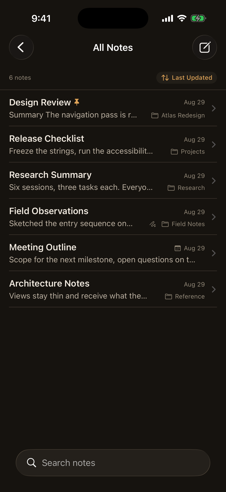
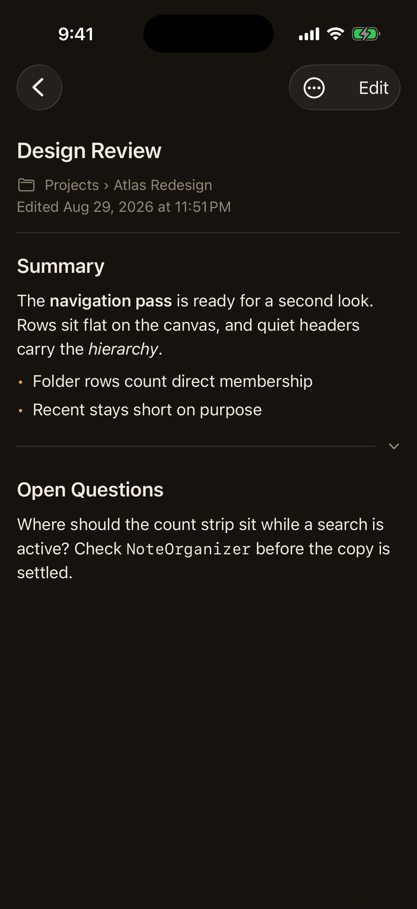
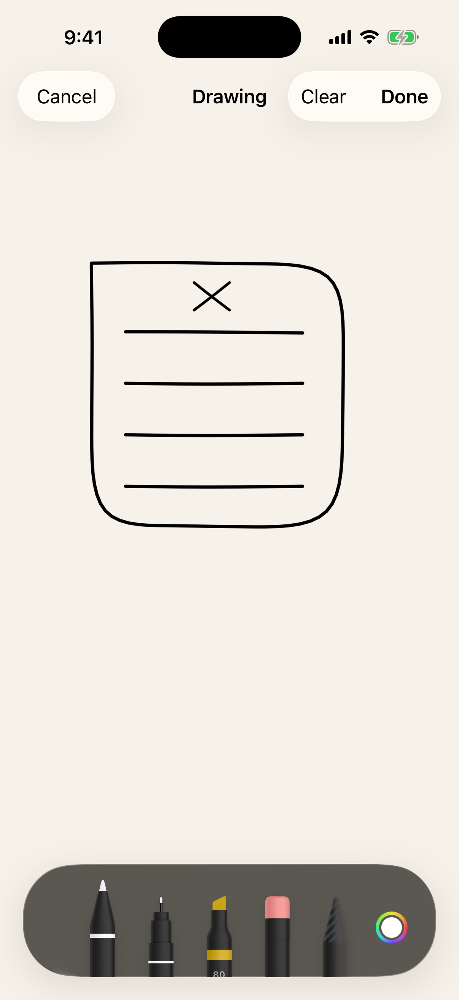

<p align="center">
  
</p>

# CaseNotes

[](https://github.com/quangshuynh/casenotes/actions/workflows/ci.yml)
[](https://quangshuynh.github.io/casenotes/)
[](https://developer.apple.com/ios/)
[](LICENSE)

CaseNotes is a local-first iOS notes app built with SwiftUI, SwiftData, and
first-party Apple frameworks. It combines Markdown writing, nested folders,
PencilKit sketches, and a device-authentication interface gate without accounts,
analytics, or cloud services.

<p align="center">
  
  
  
</p>

## Highlights

- A compact library of scopes, folders, and recently edited notes
- Note and folder creation from the library, a folder, or an empty scope
- Draft-based editing with explicit Save and Cancel behavior
- Markdown reading mode with collapsible sections, search, sorting, pinning,
  and optional event dates
- Version history that keeps previous text and restores it without losing the
  current version
- Nested folders with safe, note-preserving organization
- One optional PencilKit drawing per note
- Copy, share, Markdown file export, and PDF export of the rendered note
  including its drawing
- LocalAuthentication app lock and an immediate app-switcher privacy shield
- Dynamic Type, VoiceOver labels, and Reduce Motion support

## Technology

SwiftUI provides the interface, SwiftData persists notes and folders, and
PencilKit, LocalAuthentication, CoreTransferable, Core Text, UIKit, and
Foundation cover the platform integrations. The project has no third-party
runtime dependencies.

## Quick start

Requirements: Xcode 26.6 or newer and an iOS 26.5 simulator or device.

```bash
xcodebuild build -project CaseNotes.xcodeproj -scheme CaseNotes \
  -destination 'platform=iOS Simulator,name=iPhone 17'
```

Run the CI-gated unit suite with:

```bash
xcodebuild test -project CaseNotes.xcodeproj -scheme CaseNotes \
  -destination 'platform=iOS Simulator,name=iPhone 17' \
  -only-testing:CaseNotesTests
```

See the [full documentation](https://quangshuynh.github.io/casenotes/) for
features, architecture, persistence, privacy, testing, and development details.

## Status and limitations

CaseNotes implements its intended core scope and has not been submitted to the
App Store. Notes remain on one device unless included in that device's backups.
There is no sync or import, folders have no drag and drop or manual ordering,
drawings are not embedded in Markdown exports, and version history covers note
text rather than drawings.
Exported files are not encrypted, and the app lock gates the interface but does
not encrypt the SwiftData store. See
[limitations](https://quangshuynh.github.io/casenotes/limitations/) for the
complete list.

## License

CaseNotes is available under the [MIT License](LICENSE).
