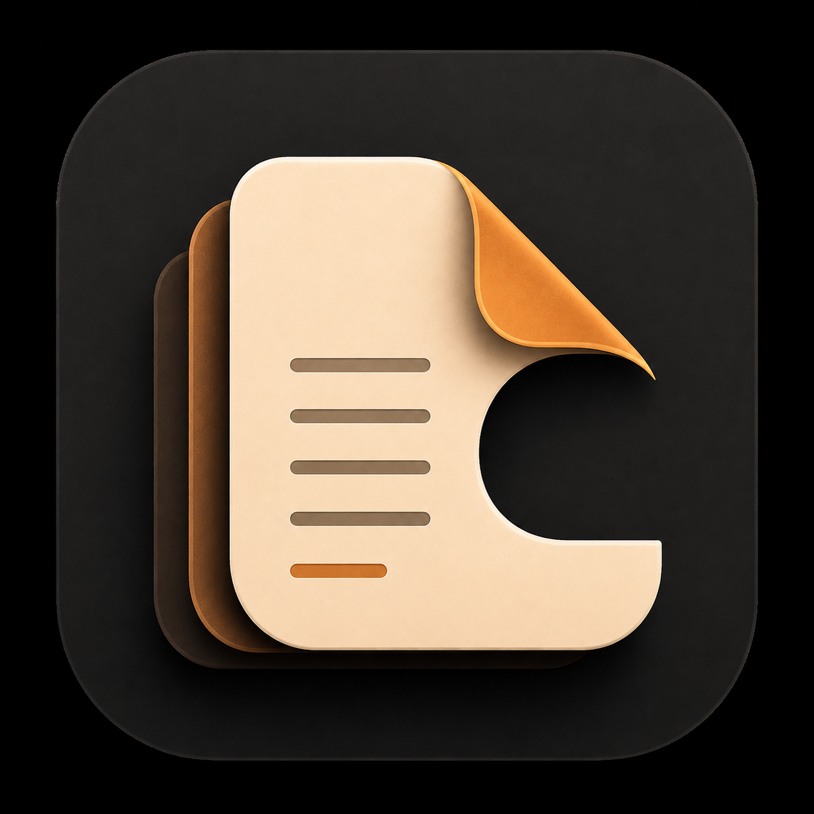

# CaseNotes documentation

<p class="casenotes-logo">
  
</p>

CaseNotes is a local-first notes app for iOS. It uses SwiftUI and SwiftData for
the core experience, Markdown for structured writing, PencilKit for sketches,
Quick Look for previewing attached files, and LocalAuthentication to gate the
interface.

The application uses first-party Apple frameworks only. It contains no
networking, account system, analytics, telemetry, advertising, or cloud
dependency.

## What you get

- Create, read, edit, pin, search, sort, and delete notes
- Browse a library of scopes, folders, and recently edited notes
- Create a note or a folder without leaving the library
- Organize notes into nested folders or leave them Unfiled
- Render Markdown in a dedicated reading view
- Write in Reading, Live Preview, or Source, three views of one stored note
- Read and restore previous versions of a note
- Attach one PencilKit drawing to a note
- Keep local files with a note and open them in the system document preview
- Place one of those files inside the note's Markdown as a block
- Copy, share, or export a note as a Markdown file or as a PDF
- Require device-owner authentication before showing note content
- Cover the interface immediately outside the active scene phase

Start with [Getting Started](getting-started.md), explore the user-facing
[Features](features.md), or read the [Architecture](architecture.md) overview.

## Development requirements

- Xcode 26.6 or newer
- An iOS 26.5 or newer simulator or device
- No package installation or service configuration for the application

Build the shared scheme from Xcode or run:

```bash
xcodebuild build -project CaseNotes.xcodeproj -scheme CaseNotes \
  -destination 'platform=iOS Simulator,name=iPhone 17'
```

The [Getting Started](getting-started.md) guide covers command-line tool
selection, running the app, and the unit-test command.

## Project position

CaseNotes is a focused portfolio and learning project. Its core feature set is
implemented and tested, but it has not been submitted to the App Store or
through a security review. The [limitations](limitations.md) page records what
the app intentionally does not support.

The app lock is an interface gate, not encryption of the SwiftData store. Sync,
import, Markdown export of drawings, and version comparison are not implemented.

## License

CaseNotes is distributed under the
[MIT License](https://github.com/quangshuynh/casenotes/blob/main/LICENSE).
